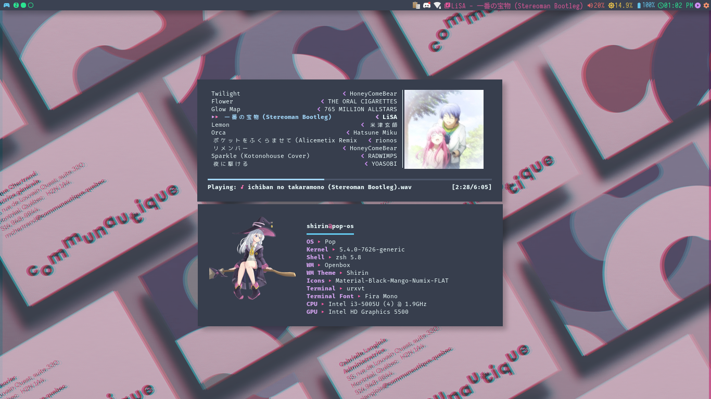
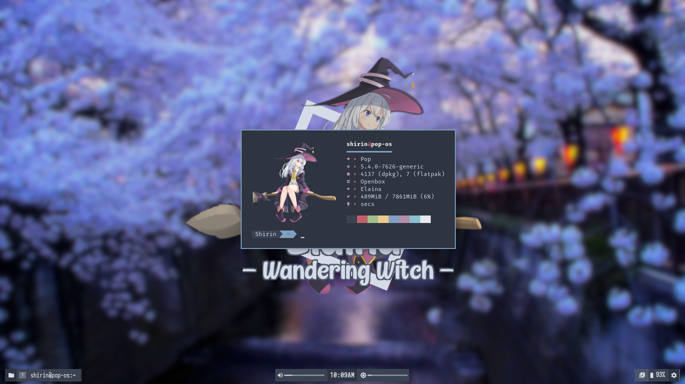

# openbox-dotfiles
My openbox theme dotfiles themes.

Screenshots soon™

## Dependencies (Apt, Ubuntu 20.04)
- clipit
- dunst
- neofetch
- openbox
- qt5ct 
- rofi
- tint2
- ncmpcpp
- mpd
- oh-my-zsh
- neovim
- urxvt
- brightnessctl
- thunar
- feh
- gsimplecal
- playerctl

## Dependencies (Manual install/PPA)
- [obmenu-generator](https://github.com/trizen/obmenu-generator) (probably discontinued, use xmenu instead)
- [picom](https://github.com/yshui/picom) [(Focal's PPA)](https://launchpad.net/~spvkgn/+archive/ubuntu/ppa) (if you using 20.10 you can install this from Apt)
- [pamixer](https://github.com/cdemoulins/pamixer) [(Focal's PPA)](https://launchpad.net/~dysfunctionalprogramming/+archive/ubuntu/pamixer)

## How to install
1. Install all the dependencies
2. Copy all files into your home folder (`~/` or `/home/$USER`)
3. Refresh font cache using `fc-cache -f -v`
4. Logout and start openbox session
5. Have fun!

## Screenshot

Shirin's base theme (Communautique)

Elaina (Nord mix theme)
